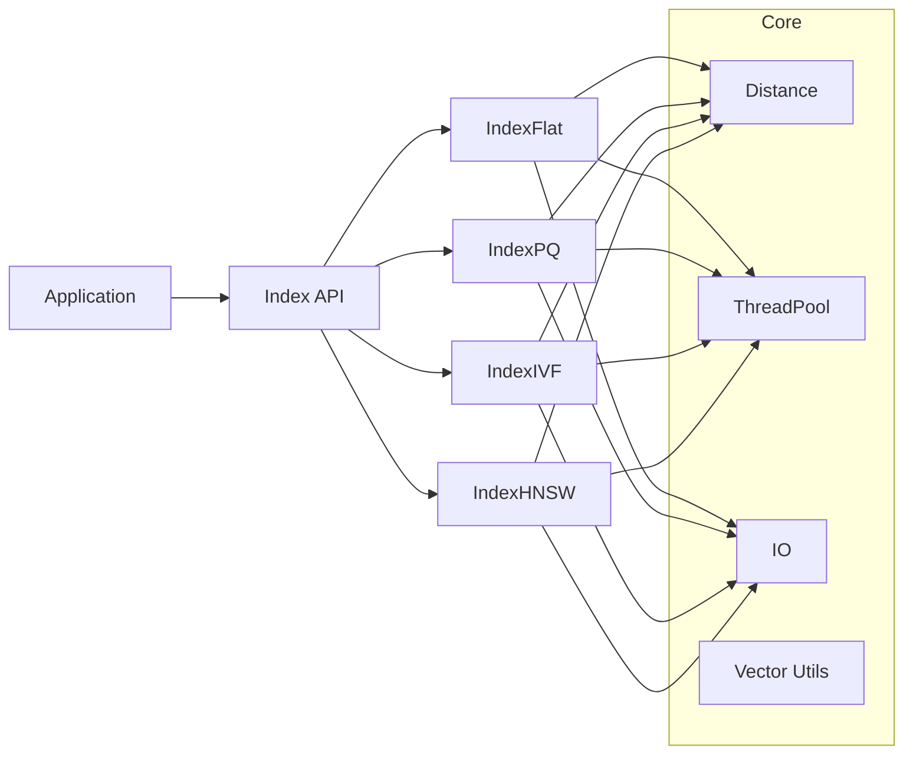

# Architecture

minimal, factual overview of current components.

## modules
- core: distance, memory, io, vector_utils, threading
- indexes: IndexFlat, IndexPQ, IndexIVF, IndexHNSW
- quantization: ProductQuantizer (k-means, ADC)
- bench: dataset loaders, metrics
- tests: unit tests

## diagram

