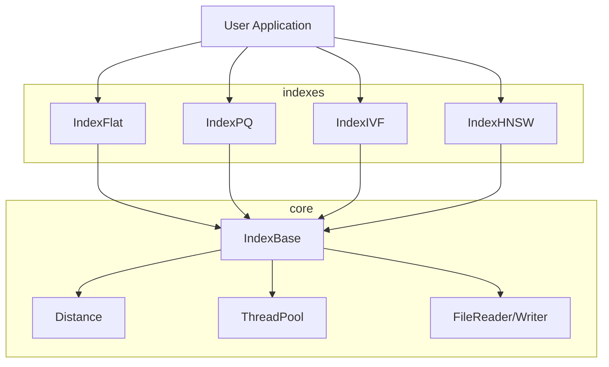

# Helix

Vector similarity search library in C++20 with GPU acceleration and Python bindings

## Features

### Core Index Types
- **IndexFlat**: Exact brute-force nearest neighbor search with SIMD optimizations
- **IndexPQ**: Product quantization with asymmetric distance computation (ADC)
- **IndexIVF**: Inverted file index with k-means clustering for approximate search
- **IndexHNSW**: Hierarchical navigable small world graph-based ANN search

### Distance Metrics
- L2 (Euclidean) distance with AVX2 SIMD acceleration
- Inner product similarity
- Cosine similarity with normalization
- Fallback implementations for non-SIMD architectures

### Performance & Scalability
- Multi-threaded batch operations with configurable thread pools
- Memory-aligned allocations for optimal cache performance
- Parallel search across multiple query vectors
- Configurable search parameters (k, nprobe, ef_search)

### Persistence & I/O
- Atomic index serialization with integrity checks
- Manifest-based metadata storage
- Support for fvecs/ivecs dataset formats
- Synthetic dataset generation for benchmarking

### Python Integration
- Zero-copy NumPy array integration via pybind11
- Type-safe bindings with automatic dimension validation
- Context-managed index handles
- Seamless integration with scientific Python stack

## Current Implementation Status

**Completed:**
- IndexFlat with brute-force exact search
- IndexPQ with product quantization and ADC
- IndexIVF with k-means clustering and inverted file structure
- IndexHNSW with hierarchical graph navigation
- Core distance metrics with SIMD optimizations
- Threading infrastructure and parallel operations
- Index persistence with manifest metadata
- Python bindings for IndexFlat
- Comprehensive test suite
- CI/CD pipeline with sanitizer support

**In Progress:**
- Enhanced persistence with copy-on-write snapshots
- GPU acceleration via CUDA backends
- Advanced Python bindings for all index types

## Contributing (short)

- open small, focused PRs with single-line commit messages
- follow coding style in this repo (4-space indent, K&R bracing)
- keep docs factual (no claims without tests)
- add unit tests for new code paths
- keep branches after merge

## Architecture



## Quick Start

### C++ API Example

```cpp
#include "helix/helix.hpp"

// Create index configuration
helix::IndexConfig config(128, helix::MetricType::L2, helix::IndexType::Flat);
helix::IndexFlat index(config);

// Train and add vectors
std::vector<float> vectors = generateRandomVectors(1000, 128);
index.train(vectors.data(), 1000);
index.add(vectors.data(), 1000);

// Search for nearest neighbors
std::vector<float> query(128, 0.0f);
auto results = index.search(query.data(), 10);
```

### Python API Example

```python
import numpy as np
import helix_py

# Create index
config = helix_py.IndexConfig(128, helix_py.MetricType.L2, helix_py.IndexType.Flat)
index = helix_py.IndexFlat(config)

# Train and add vectors
vectors = np.random.rand(1000, 128).astype(np.float32)
index.train(vectors)
index.add(vectors)

# Search
query = np.random.rand(128).astype(np.float32)
results = index.search(query, k=10)
```

## Build Requirements

- **Compiler**: C++20 compatible (GCC 12+, Clang 15+, MSVC 2022+)
- **CMake**: 3.20 or later
- **Python**: 3.10+ (for bindings)
- **CUDA**: 11.8+ (optional, for GPU acceleration)

## Building from Source

```bash
# Clone and build
git clone https://github.com/ruskaruma/Helix.git
cd Helix
mkdir build && cd build

# Configure with optimizations
cmake .. -DCMAKE_BUILD_TYPE=Release -DHELIX_BUILD_PYTHON=ON

# Build and test
cmake --build . -j$(nproc)
ctest --output-on-failure
```

### Build Configuration Options

| Option | Default | Description |
|--------|---------|-------------|
| `HELIX_BUILD_TESTS` | ON | Build unit test suite |
| `HELIX_BUILD_BENCH` | ON | Build benchmark executables |
| `HELIX_BUILD_PYTHON` | ON | Build Python bindings |
| `HELIX_BUILD_CUDA` | OFF | Enable GPU acceleration |
| `HELIX_ENABLE_SANITIZERS` | OFF | Enable memory sanitizers |

### Development Build

```bash
# Debug build with sanitizers
cmake .. -DCMAKE_BUILD_TYPE=Debug -DHELIX_ENABLE_SANITIZERS=ON
cmake --build . -j
ctest --output-on-failure
```

## Performance Characteristics

| Index Type | Search Time | Memory Usage | Accuracy | Use Case |
|------------|-------------|--------------|----------|----------|
| IndexFlat | O(n×d) | O(n×d) | 100% | Exact search, small datasets |
| IndexPQ | O(n×m) | O(n×m/8) | 95-99% | Memory-constrained applications |
| IndexIVF | O(nprobe×d) | O(n×d) | 90-98% | Large-scale approximate search |
| IndexHNSW | O(log n×d) | O(n×d×M) | 95-99% | High-dimensional, fast search |

*Where n=vectors, d=dimensions, m=subvectors, nprobe=clusters searched*

## License

MIT License - see [LICENSE](LICENSE) file for details.
