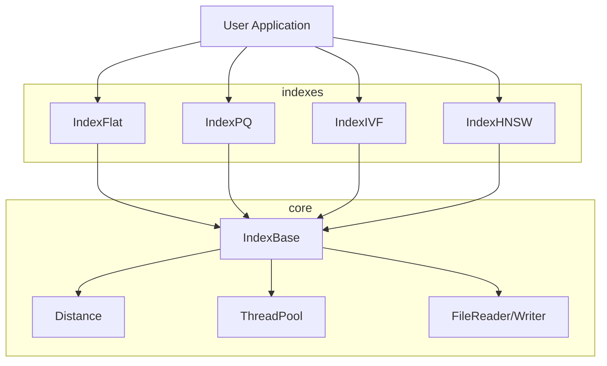

# Helix

Vector similarity search library in C++20.

## Implemented

- IndexFlat (exact brute-force search)
- IndexPQ (product quantization with ADC)
- L2, inner product, and cosine distance metrics
- Parallel batch search
- Index persistence (save/load)
- Dataset loaders (fvecs/ivecs, synthetic generation)
- Benchmarking infrastructure (recall, latency, throughput metrics)
- Product quantization with k-means codebook training

## In Progress

- IndexIVF implementation
- IndexHNSW (graph-based ANN)
- Persistence and mmapped IO improvements

## Contributing (short)

- open small, focused PRs with single-line commit messages
- follow coding style in this repo (4-space indent, K&R bracing)
- keep docs factual (no claims without tests)
- add unit tests for new code paths
- keep branches after merge

## Architecture



## Build Requirements

- C++20 compatible compiler (GCC 12+ or Clang 15+)
- CMake 3.20+
- CUDA Toolkit 11.8+ (optional, for GPU acceleration)
- Python 3.10+ (optional, for Python bindings)

## Building from Source

```bash
mkdir build && cd build
cmake .. -DCMAKE_BUILD_TYPE=Release
cmake --build . -j
ctest --output-on-failure
```

### Build Options

- `HELIX_BUILD_TESTS` - Build unit tests (default: ON)
- `HELIX_BUILD_BENCH` - Build benchmarks (default: ON)
- `HELIX_BUILD_PYTHON` - Build Python bindings (default: ON)
- `HELIX_BUILD_CUDA` - Build CUDA kernels (default: OFF)
- `HELIX_ENABLE_SANITIZERS` - Enable address/undefined sanitizers (default: OFF)

## License

MIT License
